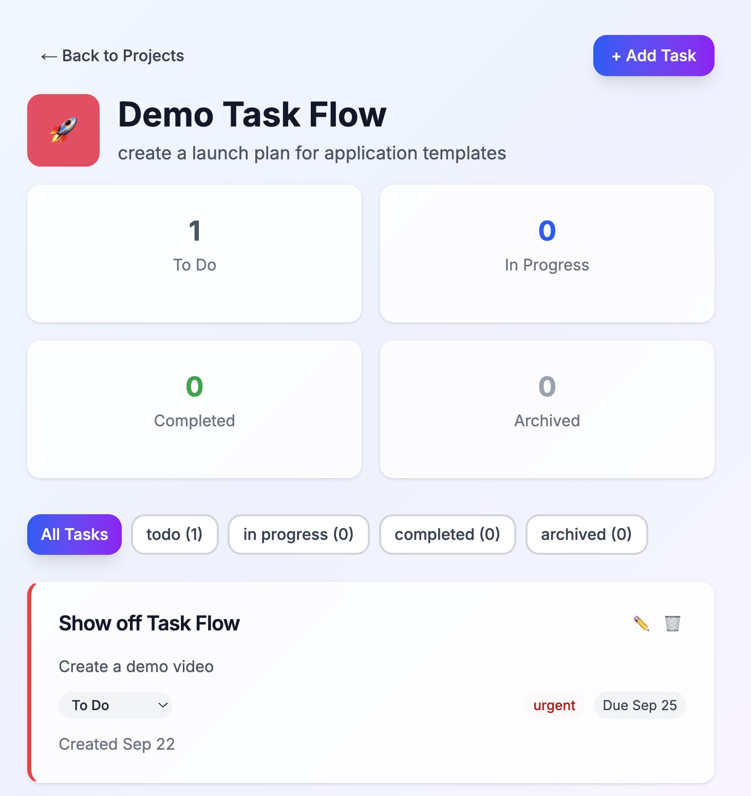

# ✨ TaskFlow - Next.js + StatelyDB Tutorial

A modern task management application built with Next.js 15+ and StatelyDB - learn how to build real-time, collaborative todo apps with StatelyDB's powerful backend!



## ✨ Features

- **Real-time Collaboration**: Work together seamlessly with StatelyDB's real-time updates
- **Beautiful Projects**: Create stunning project pages with customizable colors and emojis
- **Unlimited Tasks**: Add as many tasks as you want with priorities, due dates, and tags
- **Team Management**: Collaborate with team members and assign tasks
- **Modern UI**: Clean, responsive design with smooth animations and dark mode support
- **Mobile First**: Fully responsive design that looks great on all devices

## 🚀 Quick Start

Follow the instructions after setting up the project to get started!

[](https://console.stately.cloud/new?repo=https%3A%2F%2Fgithub.com%2FStatelyCloud%2Fnextjs-task-flow)

### ⚙️ Setting Up Locally

These steps are here for reference but you should have done them if you followed the "Build" button above.

**Clone the Repo**
```bash setup Clone the Repo
git clone https://github.com/StatelyCloud/nextjs-task-flow
cd nextjs-task-flow
```

**Install Dependencies & Login**
```bash setup Install Dependencies & Login
npm install
npm run login
```

**Generate the SDK**
```bash setup Generate the SDK
npm run generate -- --language typescript --schema-id $SCHEMA_ID ./generated
```

**Start the Application**
```bash setup Run the Application
npm run dev
```

### 2. **Visit the App**

- Home page: http://localhost:3000/
- Create your first project and start managing tasks!

## 📁 Project Structure

```
nextjs-task-flow/
├── src/
│   ├── app/                     # Next.js 15 App Router
│   │   ├── layout.tsx          # Root layout with global styles
│   │   ├── page.tsx            # Home page with stats and features
│   │   ├── projects/           # Projects management
│   │   │   ├── page.tsx        # Projects list page
│   │   │   ├── new/            # Create new project
│   │   │   │   └── page.tsx    # New project form
│   │   │   └── [id]/           # Dynamic project routes
│   │   │       └── page.tsx    # Project details and tasks
│   │   ├── api/                # API routes for server actions
│   │   │   ├── projects/       # Project CRUD operations
│   │   │   └── tasks/          # Task CRUD operations
│   │   └── globals.css         # Global Tailwind styles
│   ├── components/             # Reusable React components
│   │   ├── ui/                 # Base UI components
│   │   │   ├── button.tsx      # Button component
│   │   │   ├── card.tsx        # Card component
│   │   │   ├── badge.tsx       # Badge component
│   │   │   ├── loading.tsx     # Loading indicators
│   │   │   └── stat-card.tsx   # Statistics display
│   │   ├── add-task-modal.tsx  # Task creation modal
│   │   ├── project-card.tsx    # Project display component
│   │   ├── project-modal.tsx   # Project creation/edit modal
│   │   └── task-card.tsx       # Task display component
│   └── lib/
│       ├── stately.ts          # StatelyDB integration layer
│       └── styles.ts           # Shared style utilities
├── generated/                  # StatelyDB generated code
├── schema.ts                   # StatelyDB schema definition
├── package.json                # Dependencies and scripts
├── tailwind.config.ts          # Tailwind CSS configuration
├── next.config.js              # Next.js configuration
└── tsconfig.json               # TypeScript configuration
```

## 🔗 StatelyDB Integration

This tutorial demonstrates key StatelyDB concepts:

### **Data Models** (`schema.ts`)

- **Task**: Individual tasks with status, priority, and collaboration features
- **Project**: Project containers with progress tracking and customization
- **User**: User management with themes and activity tracking
- **Comment**: Task discussions and collaboration features
- **ProjectMember**: Team access control and role management

### **Real-time Features**

- Automatic updates when tasks change status
- Live collaboration on project tasks
- Real-time progress tracking across projects
- Instant UI updates without manual refreshing

### **Key Functions** (`src/lib/stately.ts`)

- `createTask()` - Create new tasks with automatic project updates
- `updateTask()` - Update tasks with status change tracking
- `getProjectTasks()` - Efficiently fetch all project tasks
- `createProject()` - Set up new projects with user association
- `getUserProjects()` - Get all projects for a specific user
- `updateLastActive()` - Track user activity timestamps

## 🎨 Technology Stack

- **Next.js 15+**: Modern React framework with App Router and Server Components
- **StatelyDB**: Real-time cloud database with automatic scaling and conflict resolution
- **TypeScript**: Full type safety and enhanced developer experience
- **Tailwind CSS**: Utility-first styling with custom design system and glass morphism
- **Framer Motion**: Smooth animations and micro-interactions
- **Heroicons**: Beautiful SVG icons for consistent UI
- **React Server Components**: Optimal performance with server-side rendering

## 🛠️ StatelyDB Schema Details

### **Task Model**

```typescript
{
  id: uint (sequence),           // Auto-generated unique ID
  projectId: uint,               // Parent project reference
  title: string,                 // Task name
  description: string,           // Detailed description
  status: string,                // todo | in-progress | completed | archived
  priority: string,              // low | medium | high | urgent
  assigneeId: uint,              // Assigned user ID
  creatorId: uint,               // Creator user ID
  dueDate?: timestampSeconds,    // Optional deadline
  tags?: string[],               // Categorization tags
  isActive: bool,                // Soft delete flag
  order: uint,                   // Display position
  commentCount?: uint,           // Discussion count
  createdAt: timestampSeconds,   // Creation timestamp
  updatedAt: timestampSeconds,   // Last modification
  completedAt?: timestampSeconds // Completion timestamp
}
```

### **Project Model**

```typescript
{
  id: uint (rand53),             // Random unique ID
  name: string,                  // Project title
  description: string,           // Project overview
  color: string,                 // Theme color
  emoji: string,                 // Project icon
  ownerId: uint,                 // Creator user ID
  isActive: bool,                // Visibility flag
  isPublic: bool,                // Access level
  createdAt: timestampSeconds,   // Creation timestamp
  updatedAt: timestampSeconds,   // Last modification
  taskCount?: uint,              // Total tasks
  completedTaskCount?: uint      // Finished tasks
}
```

### **User Model**

```typescript
{
  id: uint (rand53),             // Random unique ID
  email: string,                 // User email
  name: string,                  // Display name
  avatar: string,                // Profile image/emoji
  isActive?: bool,               // Account status
  timezone: string,              // User timezone
  theme: Theme,                  // UI preference (LIGHT/DARK/SYSTEM)
  createdAt?: timestampSeconds,  // Registration date
  lastActiveAt?: timestampSeconds // Activity tracking
}
```

## 🚀 Development

### **Available Scripts**

```bash
npm run dev          # Start development server (localhost:3000)
npm run build        # Build for production
npm run start        # Start production server
npm run lint         # Run ESLint for code quality
npm run type-check   # TypeScript type checking
```

### **Environment Variables**

```bash
# .env.local
STATELY_STORE_ID=your_store_id_here
STATELY_ACCESS_KEY=your_access_key_here
NEXT_PUBLIC_APP_URL=http://localhost:3000
```

## 🎨 Customization

### **Custom Themes**

Modify `src/app/globals.css` and `tailwind.config.ts` to add new color schemes and design tokens.

### **Additional Fields**

Extend the StatelyDB schema in https://console.stately.cloud, regenerate the client, and update the UI components accordingly.

## 🔧 Advanced Features

- **Optimistic Updates**: UI updates immediately with automatic rollback on errors
- **Batch Operations**: Efficient bulk task operations with transactions
- **Real-time Subscriptions**: Live data synchronization across browser tabs
- **Conflict Resolution**: Automatic handling of concurrent edits
- **Offline Support**: Local caching with sync when connection restored

## 🚀 Deployment

### **Build and Deploy**

1. Build the application: `npm run build`
2. Set production environment variables
3. Deploy to Vercel, Netlify, or your preferred platform
4. Configure StatelyDB for production workloads

### **Production Environment Variables**

```bash
STATELY_STORE_ID=your_production_store_id
STATELY_ACCESS_KEY=your_production_access_key
NEXT_PUBLIC_APP_URL=https://your-domain.com
```

### **Recommended Platforms**

- **Vercel**: Optimal Next.js hosting with automatic deployments
- **Netlify**: JAMstack deployment with edge functions
- **AWS Amplify**: Full-stack deployment with CI/CD
- **Railway**: Simple deployment with database integration

## 📚 Learning Resources

- [StatelyDB Documentation](https://docs.stately.cloud) - Complete StatelyDB reference
- [Next.js 15 Documentation](https://nextjs.org/docs) - Next.js App Router guide
- [React Server Components](https://react.dev/reference/react/use-server) - Server-side rendering
- [Tailwind CSS](https://tailwindcss.com/docs) - Utility-first CSS framework
- [TypeScript Handbook](https://www.typescriptlang.org/docs/) - Type safety guide

## 🤝 Contributing

This is a tutorial project designed for learning StatelyDB and Next.js concepts. Feel free to:

- Fork the repository for your own experiments
- Submit issues for bugs or improvements
- Create pull requests with enhancements
- Share your own variations and extensions

### **Development Workflow**

1. Fork and clone the repository
2. Install dependencies: `npm install`
3. Set up your StatelyDB credentials
4. Make your changes and test thoroughly
5. Run linting and type checking
6. Submit a pull request with clear description

## 📄 License

MIT License - feel free to use this code for learning and building your own applications!

---

**Built with ❤️ using StatelyDB and Next.js**

For questions or support, visit the [StatelyDB Discord](https://discord.gg/kzR3Etrp) or check out the [documentation](https://docs.stately.cloud).
